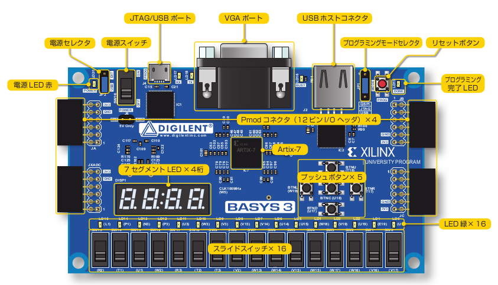

# STEP 01

1.FPGA
FPGA stands for "Field Programmable Gate Array". Its circuit can be repeatitively changed easily by users 

2.Artix-7
Artix-7 is the middle-class products made by XILINX company, which uses 28 nm process

{ width=100% }

3.Basys3 board layout
Power selector is used in two ways, which are external power mode and USB power mode. Formar 
uses power supplied from J6 pin. Latter uses power suppled from JTAG/USB port. There are three modes in programming mode selector. The first one is QSPI mode. it boots programs stored in ROM when power is turned on. The second one is JTAG mode. it is executed by sending programs from PC. The last one is USB mode. it is executed by trasmitting programs from USB memory connected to USB host connector.
