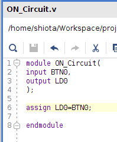

# STEP 03
## How to create projects  
1.Start Vivado.  
2.Select "Create New Project" from "Quick Start".  
3.Click "Next" after "New Project" wizard starts.  
4.Configure the settings such as project name and storage location.  
5.Specify project type.  
6.Specify HDL language.  
7.Set file name.  
8.Click "Next" after source file is created.  
9.Specify IP, DSP composites and sub design file.  
10.Specify or Create constraint files.  
11.Specify model.  
12.Click "Finish" after contents set before is shown.  
13.Define input and output port name.  

