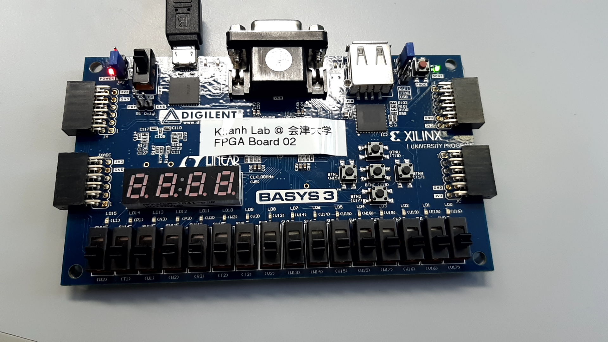
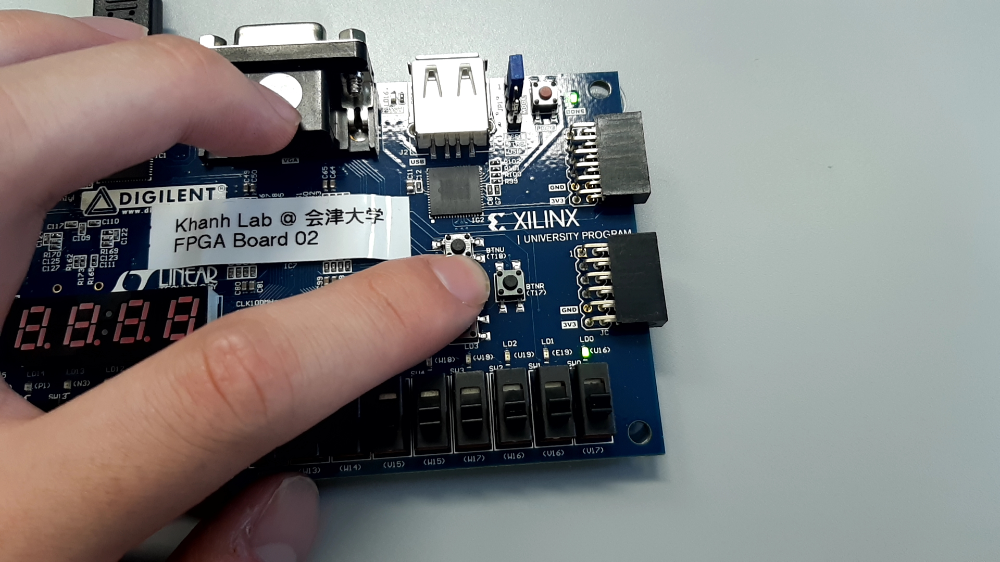

# STEP 04
## Synthesise
1.Press "Run Synthesis".  
2.Select "Open Synthesized Design" and click "OK" after synthesis finished correctly.  
## Device Constraints
1.Select "Opent Synthesized Design".  
2.Configure property setting of a device.  
3.Set input and output pins in "I/O ports".  
4.Save a constraint condition.  
5.Click "OK" when window is displayed information concerning "Out of Date Design".  
6.Specify file name.  
7.Press "more info".  
8.Click "Force up-to-date".  
## Generate Bitstream
1.Select "Generate Bitstream".  
2.Click "Save" when "Save Project" window opens.  
3.Click "OK" when window is displayed information concerning "Out of Date Design".  
4.Select "Open Hardware Manager".
5.Select the botton colored in blue depending of contents when messages are displayed.  
## JTAG Programming
1.Connect Basys4 board with PC and turn its switch on.
2.Select "Open Hardware Manager".
3.Press "Auto Connect".
4.Click "xc7a35t_0".
5.Click "Program" when "Program Device" window opens.
6.Check that LD0 is bright when BTNC botton is pushed and is off when BTNC botton is not pushed.  

