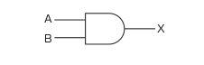
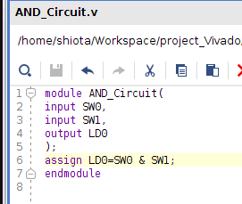
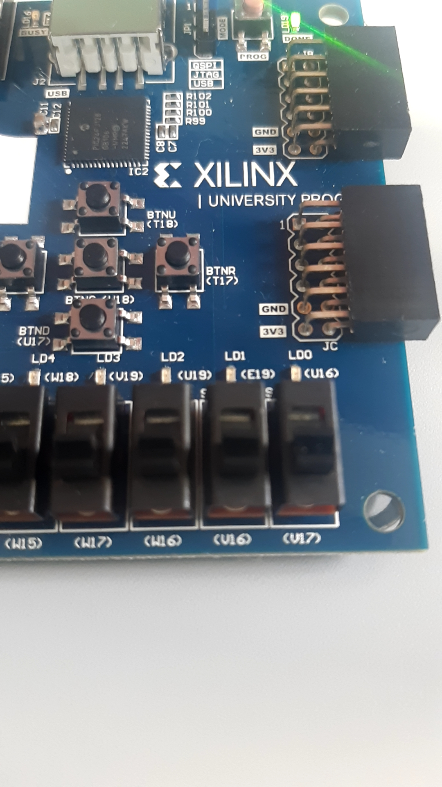
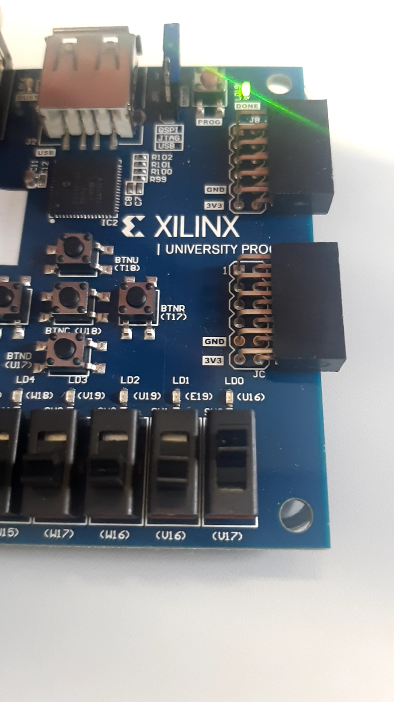
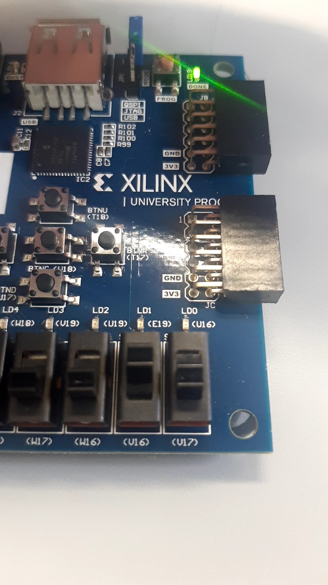
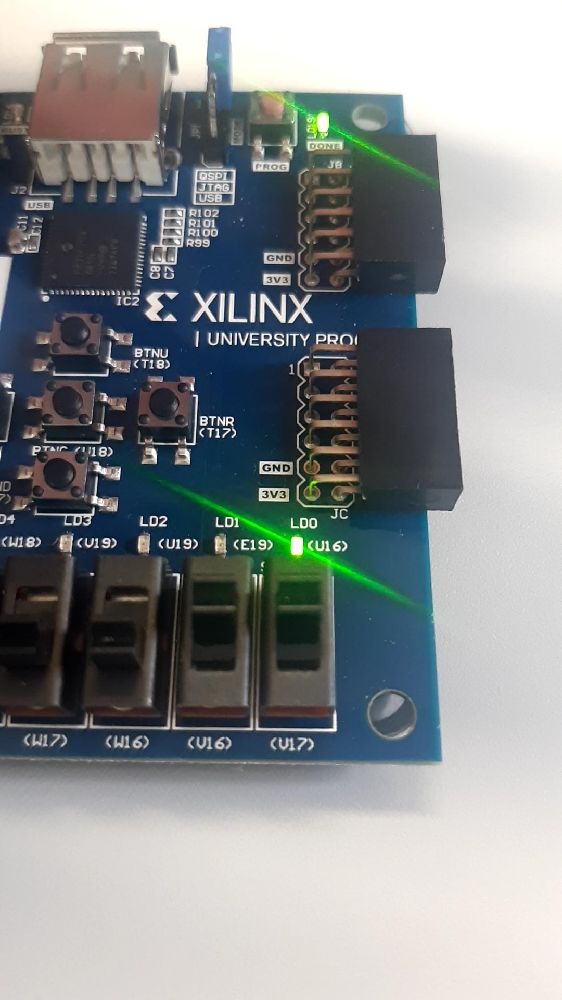

# STEP 05
## Combinational Circuit  
Combinational circuit is a circuit that output always same if inputs are same.  
## AND Circuit  
"AND" is calculation that output is "1" only when all inputs are "1". The picture displayed below is a circuit signal of AND circuit.  
  
## Description of Program  
1.module() ~ endmodule  
It is always declared when a program is descripted.  
2.Input, Output
Input ports are declared as "input".  
Output ports are declared as "output".  
3.Assign  
"assign" is equivalent to wire connection. It is used to descript a combinational circuit.  
4.&  
"&" calculates "AND" of input signals   
## Domonstration
Code  
  

SW0=0, SW1=0  

SW0=1, SW1=0  

SW0=0, SW1=1  

SW0=1, SW1=1

