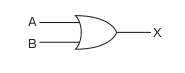
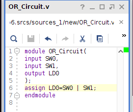
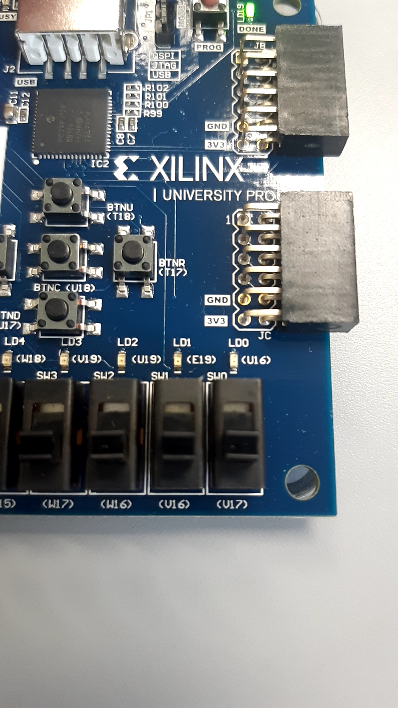
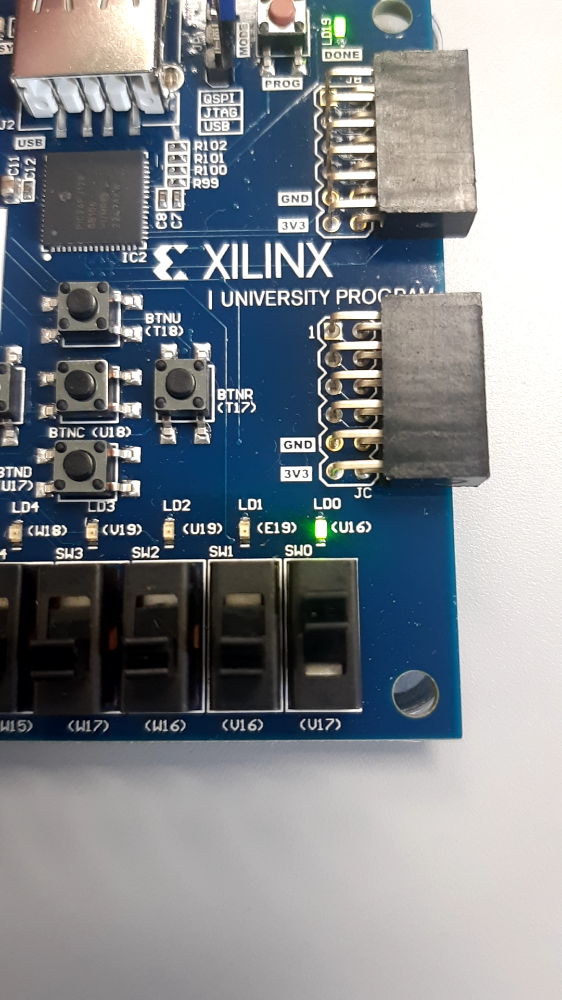
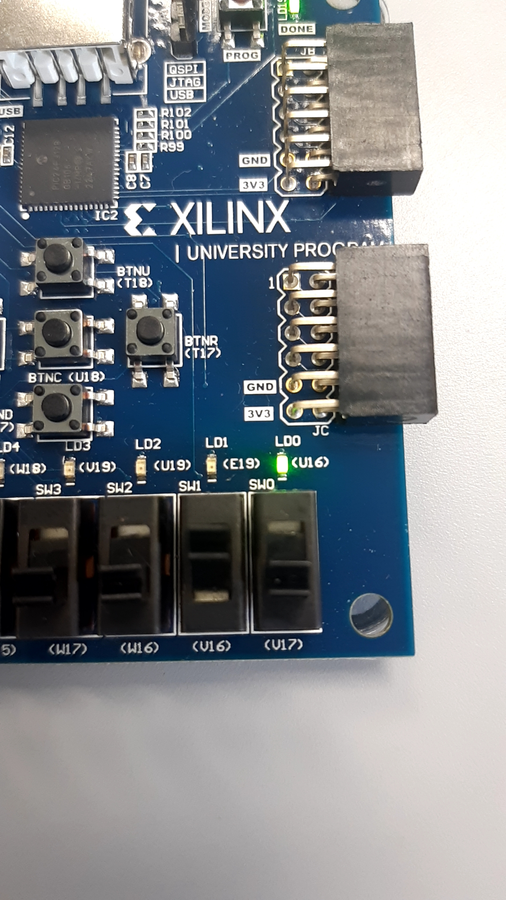
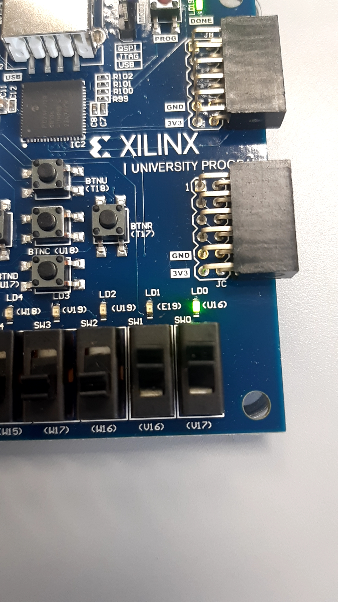
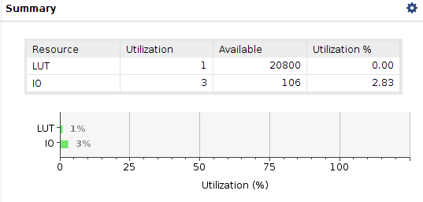
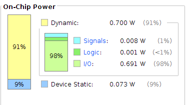

# STEP 06
## OR Circuit
"OR" is calculation that output is "1" when one or more inputs are "1". The picture displayed below is a circuit signal of OR circuit.  

## Description of Program
"|" calculates "OR" of input signals.
## Demonstration
Code  
  

SW0=0, SW1=0  
  

SW0=1, SW1=0  
  

SW0=0, SW1=1  
  

SW0=1, SW1=1  

## Summary
  

