# STEP 07
## Selector Circuit
Selector circuit is the circuit that select an input from multi inputs. When selection signal "S" is 0, input "A" is output to "Y". When "S" is 1, input "B" is output to "Y".  
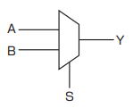
## Assignment 07-1 (2-input selector circuit)
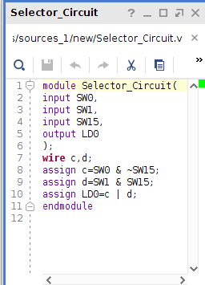  
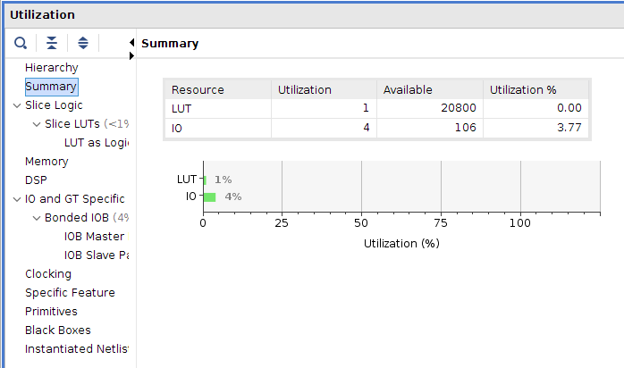  
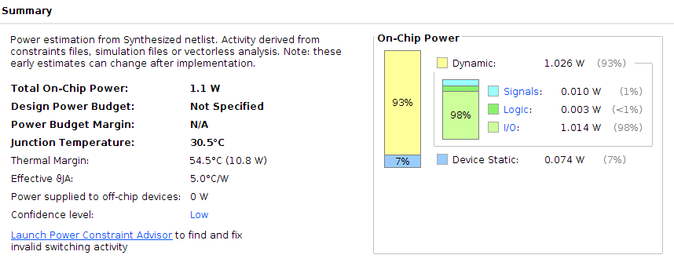
## Assignment 07-2 (2-input selector circuit)
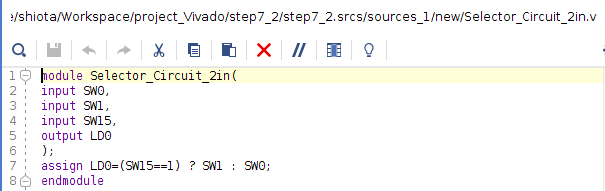  
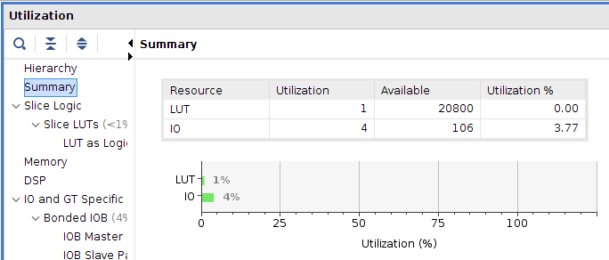  
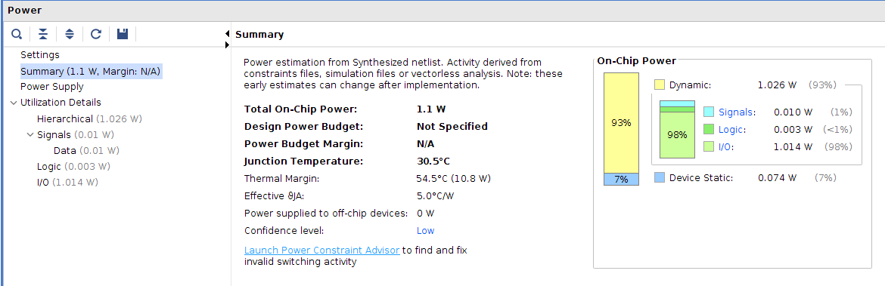
## Assignment 07-3 (3-bit selector circuit)
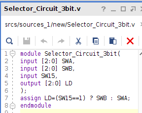  
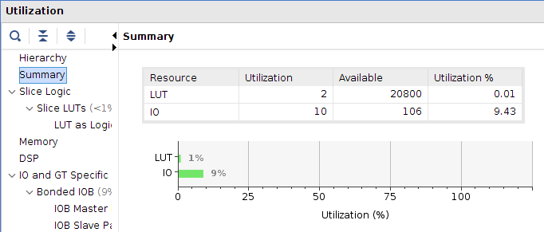  
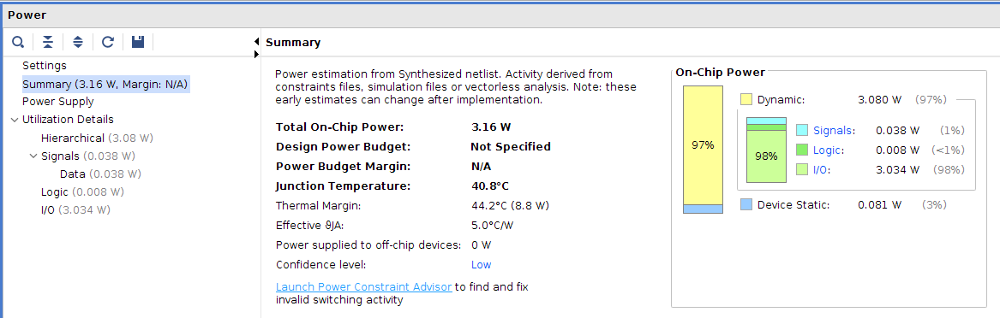
## Assignment 07-4 (4-input selector circuit)
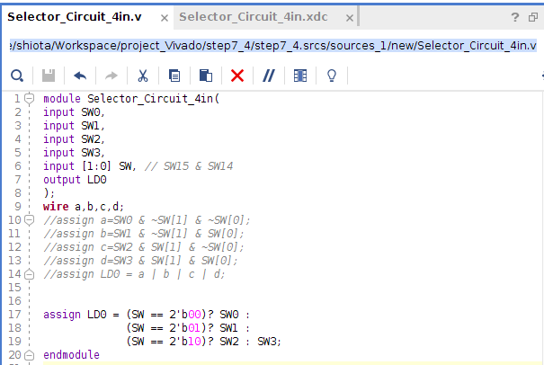  
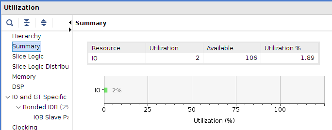  
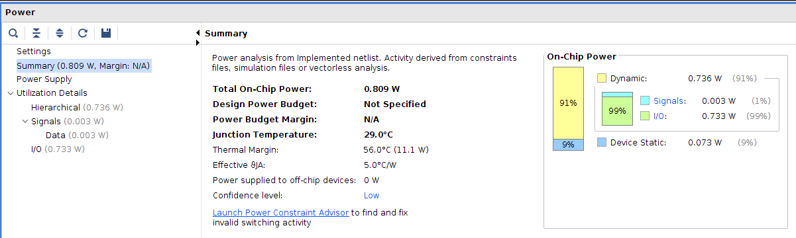
