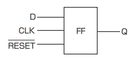
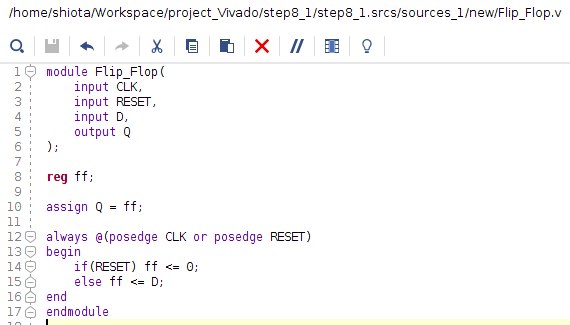
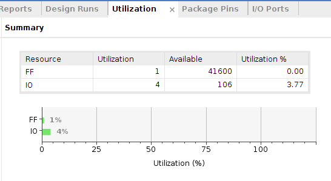
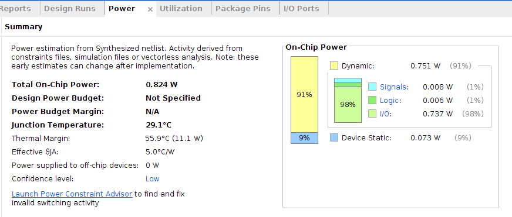
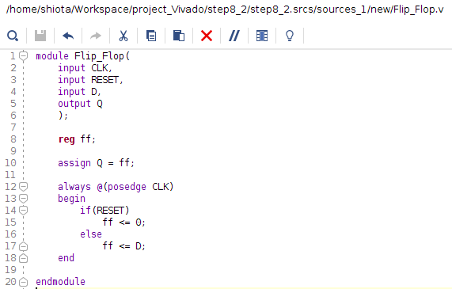
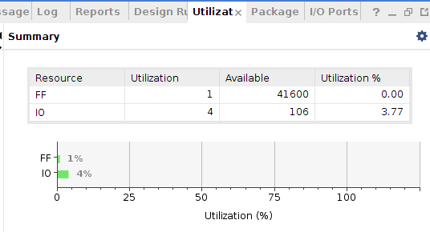
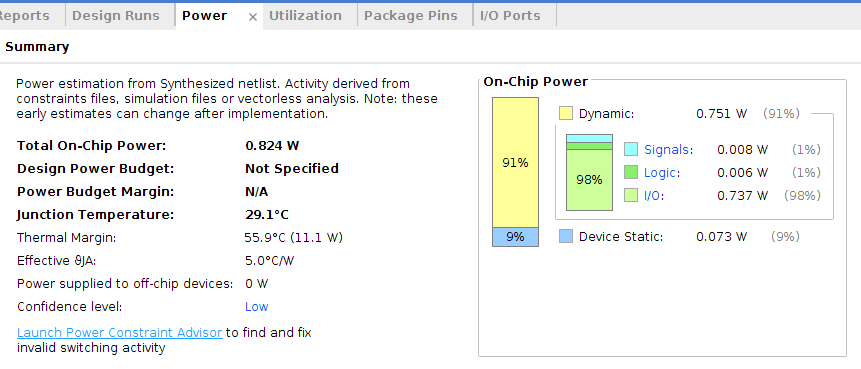

# STEP 08
## Sequential Circuit
Sequential circuit is a circuit which have memory elements in its circuit. Its output is decided depending on input signals in the past.  
Flip Flop is a circuit which can retain 1-bit information. It is a basic circuit used in main memory, cache memory and register. Information is retained only when power is on and disappears when power is off.
## Flip Flop Circuit
It is flip flop whose nput signals are input "D", RESET signal and CLK (clock) signal and output signal is "Q". Input signal "D" is stored and retained when CLK signal rises. Data flip flop retains is output to "Q".  

## Assignment 8-1
  
  

## Assignment 8-2
  
  

