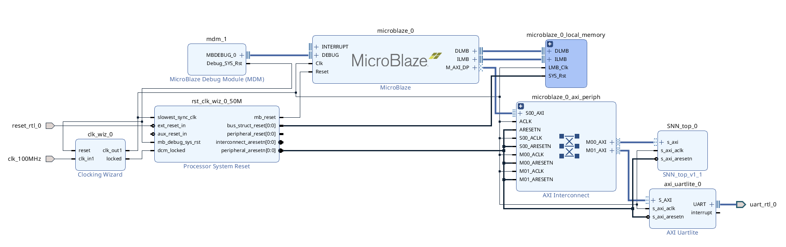

# FPGA demo for SNN

## Environment
- Xilinx Vivado 2019.1
- Arty A7

## Command
In terminal,
```
source /home/Tools/Xilinx/Vivado/2019.1/settings64.sh
cd FPGA/SNN/
make clean && make
vivado SNN.xpr &
```

## Procedure
[manual](https://github.com/klab-aizu/FPGA_SNN_Accelerator_Arty_A7_100T/tree/main/SLIDE/FPGA_SNN_Tutorial.pdf)

## SoC


- Baud Rate: 115200
- Clock Frequency: 50MHz
- Instruction Cache: 32kB
- Data Cache: 32kB
- System RAM: 128kB
- SNN IP Address: (0x44Aa0_0000 - 0x44a0_FFFF)
- UART Address: (0x4060_0000 - 0x4060_FFFF)
- Local Memory Address: (0x0000_0000 - 0x0001_FFFF)
